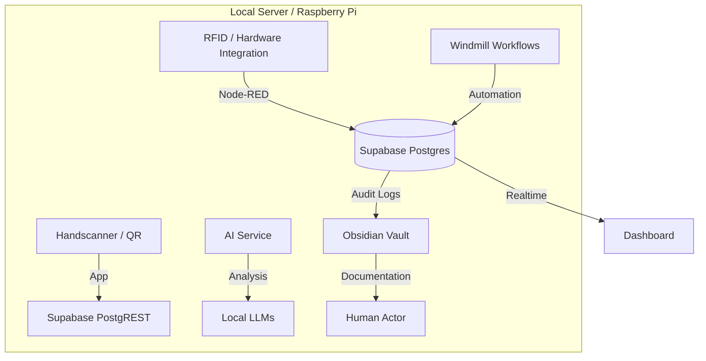

# Systemarchitektur

## Einführung
Das Münchner Kindl System ist eine lokale Infrastruktur zur Verwaltung und Nachverfolgung von RFID-Holzfässern. 

## Komponenten-Diagramm

## Datenfluss
1. **RFID Scan**: Ein Fass wird gescannt. Node-RED empfängt die UID.
2. **Datenabgleich**: Node-RED fragt die Supabase Datenbank ab.
3. **Status-Update**: Bei Erfolg wird ein `barrel_movement` Eintrag erstellt.
4. **Automatisierung**: Windmill triggert Pfandbuchungen oder Wartungshinweise.
5. **KI-Analyse**: Der AI Service wertet Bewegungen aus und gibt Empfehlungen.

## Sicherheit & Offline-Betrieb
Das System ist so konzipiert, dass es ohne Internetverbindung im lokalen Netzwerk (LAN) funktioniert.
Authentifizierung erfolgt lokal über Supabase Auth.
