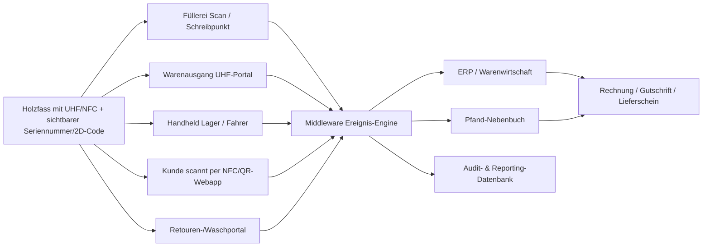
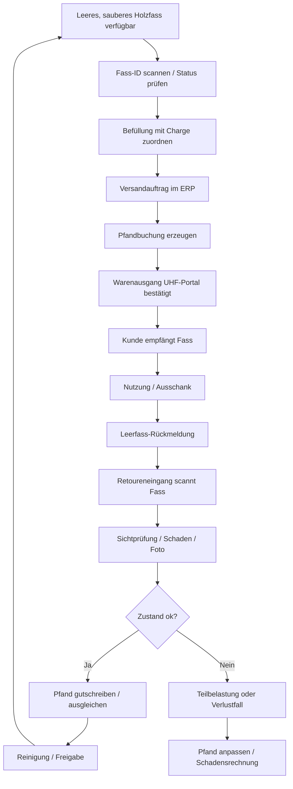
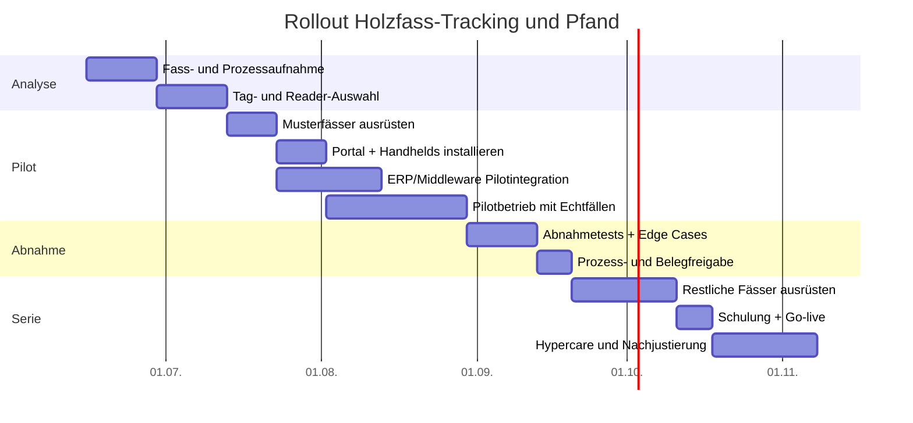

Praxissicheres Tracking- und Pfandsystem für Holzbierfässer

## Management Summary

Für Ihre Brauerei ist **kein rein theoretisches RFID-Projekt**, sondern ein **betriebssicheres Mehrweg- und Pfandsystem** sinnvoll, das jede Fassbewegung im Alltag eindeutig abrechnet, dokumentiert und bei Lesefehlern nicht stehen bleibt. Die wichtigste Erkenntnis aus den Quellen ist: **Eine physikalisch absolute 100%-Funklesung lässt sich nicht seriös versprechen**, weil Reichweite und Lesesicherheit von Frequenz, Ausrichtung, Materialumgebung und Einbausituation abhängen; selbst bei Keg-Anwendungen wird genau diese Bulk-Read-Zuverlässigkeit als Kernproblem beschrieben. **Praktisch 100% funktionsfähig** wird das System deshalb nur als **Mehrschicht-System**: automatische UHF-Lesung an Toren, manuelle Bestätigung per NFC oder sichtbarem 2D-Code, Pflichtscan an jedem Haftungsübergang, tägliche Differenzklärung und definierte Offline-/Notfallverfahren. citeturn34view1turn22search2turn23search13

Für eine Brauerei mit 40 hl pro Sud und Holzfässern in 10 L, 30 L und 200 L empfehle ich **kein LoRa-Tracking pro Fass** und auch **keine reine NFC-Lösung**. Die beste Praxis-Lösung ist ein **batterieloser, robuster UHF-Hard-Tag auf jedem Fass** und – für Bedienung mit Smartphones, Kundenquittung und sichere Ausnahmebearbeitung – **zusätzlich NFC bzw. ein sichtbarer GS1-konformer QR-/DataMatrix-Code**. Technisch am saubersten ist ein **Dual-Frequency-Hardtag UHF + NFC** mit gemeinsamer oder logisch verknüpfter Identität; alternativ funktioniert auch **UHF als Primär-ID plus sichtbarer 2D-Code als Fallback**. UHF liefert die notwendige Reichweite für Tore und Sammellesung, NFC bzw. QR schafft den praxissicheren manuellen Fallback ohne Spezialhardware auf Kundenseite. citeturn28view0turn29view0turn29view1turn38view1

Für Ihre Größe ist die wirtschaftlich sinnvollste Zielarchitektur ein **Mid-Tier-System**: zwei robuste Handhelds, ein festes UHF-Portal für Versand/Retouren, ein EPCIS-ähnliches Ereignismodell in der Middleware, ERP-Anbindung über offizielle APIs, sowie ein separates **Pfand-Nebenbuch** mit klarer Zuordnung pro Fass, Kunde, Rechnung, Schadensfall und Rückgabe. Größere aktive Tracking-Technologien wie BLE oder LoRa sollten nur **für Sonderfälle** eingesetzt werden, etwa für wenige sehr hochwertige 200-L-Fässer, Festivalbestände oder Außenlager mit Geofencing. citeturn38view0turn39view0turn39view1turn30view2turn30view1

## Technische Zielarchitektur

### Geeignete Chip- und Funktechnologien

| Technologie | Typische Praxismerkmale | Vorteile | Grenzen | Geeignet für Ihre Brauerei | Quellen |
|---|---|---|---|---|---|
| **Passiver UHF-Hardtag** | batterielos; auf Holz/„any material“ montierbar; Reichweite je nach Tag/Reader typischerweise bis ca. 8–11 m; IP69K/IP68 bei Industrie-Hardtags | ideal für automatische Torlesung, Ladehof, Inventur, Warenausgang | Funkleistung hängt von Einbau, Ausrichtung und Umgebung ab; kein Smartphone-Fallback ohne Zusatzcode | **Ja, als Primärtechnologie** | citeturn29view0turn29view1turn22search2 |
| **Dual-Frequency UHF + NFC Hardtag** | UHF für Gate/Handheld, NFC für Smartphone/Einzelfall; robuste Gehäuse, teilweise IP68; gemeinsame oder gekoppelte Identität | beste Kombination aus Automatik und manuellem Fallback; Kunden können ohne Spezialleser bestätigen | höherer Tagpreis; UHF-Reichweite je nach Bauform geringer als Spezial-UHF-Tags | **Ja, beste Gesamtlösung** | citeturn28view0turn21search4turn34view1 |
| **Sicherer NFC-Tag** | passiv, keine Batterie; Smartphone-kompatibel; wenige Zentimeter Reichweite; NTAG 424 DNA unterstützt AES-128/SUN | sehr gut für Echtheitsprüfung, sichere Kundeninteraktion, digital signierte Scan-URLs | nicht geeignet für Torlesung oder Bulk-Read | **Nur ergänzend** | citeturn16search1turn16search2turn16search6 |
| **BLE-Beacon** | batteriebetrieben; ca. bis 100 m Reichweite; Lebensdauer typischerweise 7–8 Jahre je Konfiguration; IP69K möglich | gut für Yard/RTLS/Sonderfässer, Bewegung/Temperatur | Batterie-Management, Beacon-Gateways nötig, kein Bulk-Read-Ersatz | **Nur Sonderfälle** | citeturn30view2turn31view0turn17search1turn17search9 |
| **LoRaWAN-Tracker** | batteriebetrieben; kilometerweite Gateway-Abdeckung; 1–12 Jahre je Sendefrequenz; pro Gerät deutlich teurer | sinnvoll für Außenlager, Fernortung, Langzeit-Assets | für jedes 10/30-L-Fass zu teuer und wartungsintensiv; Gateway-/Netzaufwand | **Nein, nicht pro Fass** | citeturn30view1turn30view0turn17search3turn17search11 |

Die klarste Entscheidung ist daher: **Primär UHF**, **sekundär NFC oder sichtbarer 2D-Code**, **kein aktiver Tracker pro Standardfass**. Aktive Tracker lösen ein anderes Problem – Fernortung –, nicht das Kernproblem Ihrer Brauerei: **eindeutige Übergabe, Rücknahme, Pfand, Reinigung, Wiederbefüllung und ERP-Buchung jedes einzelnen Holzfasses**. citeturn30view1turn30view2turn38view0

### Empfohlene Tag-Bauform und Montage auf Holzfässern

Da Ihre Gebinde **Holzfässer** sind, ist die Umgebung für UHF grundsätzlich günstiger als blankes Metall; mehrere Industrietags sind ausdrücklich für **Holz, Kunststoff oder „any material“** spezifiziert. Für den Brauereialltag sind jedoch nicht dünne Etiketten, sondern **robuste Hardtags** entscheidend, weil Fässer Stoß, Nässe, Reinigung und Scheuerstellen ausgesetzt sind. HID nennt für seine robusten UHF-Tags Montage auf **Holz** per Schraube, Niete, Industriekleber oder sogar Nägeln; Beontag empfiehlt bei hoher mechanischer Belastung ausdrücklich **mechanische Fixierung** statt reiner Klebung. citeturn29view0turn29view1turn28view0

**Empfohlene Praxislösung für Holzfässer:**

1. **Primär-ID pro Fass:** ein **robuster UHF-Hardtag** oder **Dual-Frequency-Hardtag**.
2. **Sekundär-ID pro Fass:** **sichtbare, dauerhaft gravierte Fassnummer** plus **2D-Code**.
3. **Montage:** **servicefähige, geschützte Position**, nicht frei exponiert auf der Mantelfläche. Sinnvoll ist eine **versenkte Montage am Fasskopf** oder eine **geschützte Montage unter/nahe dem Fassreifen**, sofern das konkrete Fassmodell dies zulässt. Das ist eine planerische Schlussfolgerung aus den verfügbaren Befestigungsarten und der Forderung nach geschützter, mechanisch fester Position; sie muss auf Ihrem realen Fassmodell mit Wasch-, Stoß- und Falltests validiert werden. citeturn29view0turn28view0turn34view1

**Wichtig:** Ein vollständig im Holz „vergossener“ Chip ohne Servicezugang klingt elegant, ist aber betriebspraktisch riskant. Wenn ein Tag ausfällt, muss er **tauschbar** sein. Deshalb sollte der „eingebaute Chip“ in der Serie als **austauschbare Tag-Kassette** oder als **geschützte Einlassung** konstruiert werden – nicht als irreversibel eingegossenes Bauteil. Diese Empfehlung ist eine belastbare Engineering-Schlussfolgerung aus den verfügbaren Tag-Befestigungen, den Reinigungs-/Chemikalienanforderungen und der Pflicht, Endbedingungen im Zielprozess zu testen. citeturn28view0turn29view0turn29view1

### Konkrete Empfehlung für Sie

Für Ihre Brauerei ist die beste Standardisierung:

- **10 L / 30 L / 200 L Holzfass:** jeweils eigener Artikelstamm im ERP.
- **Jedes einzelne Fass:** eigene **Seriennummer/Asset-ID**.
- **Technik je Fass:**  
  **Variante A – empfohlen:** Dual-Frequency-Hardtag UHF + NFC.  
  **Variante B – wirtschaftlicher:** robuster UHF-Hardtag + sichtbarer QR/DataMatrix.  
- **Zusatz für Premium-/Sonderfässer:** optional BLE nur bei wenigen 200-L-Fässern mit langem Außeneinsatz. citeturn28view0turn29view0turn30view2turn38view1

## Hardware und Installation im Betrieb

Die zuverlässigsten keg-/RTI-Projekte kombinieren **feste Scanpoints an Schlüsselpunkten** mit **Handhelds** für Ausnahmen. Genau dieses Muster zeigen Keg-Tracking-Whitepaper und RTI-Fallstudien: fester Scanner an Fülllinie oder Gate, Handscanner für Einzelkontrolle vor Ort, ERP-Interface für Versandprüfung und Bestandswahrheit. Für Ihre Größe ist diese Architektur deutlich robuster als eine Vollautomatisierung in Fahrzeugen oder beim Kunden. citeturn34view2turn40view0

### Empfohlenes Hardware-Setup

| Standort | Hardware | Zweck | Empfehlung |
|---|---|---|---|
| **Füllerei / Abfüllpunkt** | Handheld UHF/NFC oder Schreibstation | Fass-ID prüfen, Status „leer/sauber“ → „gefüllt“ setzen, Charge zuordnen | **Pflicht** |
| **Warenausgang / Rampe** | fixes UHF-Portal mit 1 Reader + 2–4 Antennen + Lichtschranke/Richtungslogik | automatische Sammellesung bei Versand, Beladekontrolle | **Pflicht** |
| **Retouren / Waschannahme** | fixes UHF-Portal oder Handheld | automatische Rücknahme, Differenzprüfung, Retourenstatus | **Pflicht** |
| **Lager / Hofbestand / Ausschank intern** | 1–2 Handhelds | Inventur, Umsetzungen, Ausnahmefälle | **Pflicht** |
| **Lieferfahrzeug** | Handheld im Fahrerprozess, optional Fahrzeughalterung | Auslieferbeleg, Rücknahme, Offline-Fallback | **Pflicht, aber als Handheld** |
| **Gewerbekunde** | Smartphone-Webapp per NFC/QR, kein Spezialreader erforderlich | Empfang bestätigen, Leerfass melden, Übergabe dokumentieren | **Empfohlen** |
| **Taproom / Gastro vor Ort** | POS-/ERP-Scan via Handheld oder Kamera | Direktverkauf mit Seriennummer und Pfandbeleg | **Pflicht** |

### Geeignete Reader und Infrastruktur

Ein robuster Handheld wie der **Zebra MC3330xR** liegt aktuell grob bei **ca. 2.450–3.154 EUR exkl. MwSt.** und ist für Standard-Range-UHF gedacht; der **Zebra RFD40** als Sled liest laut Datenblatt **1.300+ Tags pro Sekunde** bei **bis zu 12 m Reichweite**, hat IP54 und unterstützt **Batch-Modus mit bis zu 40.000 Tags**, was für Offline-Fallback sehr wertvoll ist. Für fixe Portale sind Reader wie der **Impinj R700** oder **Zebra FX9600** geeignet; der R700 unterstützt **PoE**, **REST API**, **MQTT** und Linux-basierte On-Reader-Logik, während der FX9600 für rauere Umgebungen **PoE/PoE+**, bis zu **acht RF-Ports** und Edge-Verarbeitung bietet. citeturn41search12turn41search14turn32view1turn33view0turn32view0

Für die Antennen reichen bei einer kleinen Brauerei in der Regel **2 bis 4 zirkular polarisierte UHF-Antennen pro Portal**. Marktpreise liegen derzeit grob bei **ca. 125–215 EUR pro Antenne**, je nach Bauform und Schutzklasse. Wichtig ist weniger „Maximum Reichweite“ als **kontrollierte Lesezone**, damit nicht Nachbarfässer oder Lagerplätze mitgelesen werden. citeturn42search0turn42search1turn42search3turn42search6

Wenn Sie BLE oder LoRa in Sonderfällen einsetzen, braucht das zusätzliche Infrastruktur: BLE-Gateways bzw. Access Points oder LoRaWAN-Gateways. Ein LoRaWAN-Gateway wie das **Milesight UG65** unterstützt Ethernet, Wi‑Fi und Mobilfunk-Backhaul sowie MQTT/HTTP(s)-APIs, ist aber für Standardfässer Ihrer Betriebsgröße kein Muss. citeturn30view0

Das folgende Architekturdiagramm setzt genau diese Scanpunkte in einer für eine kleine bis mittlere Brauerei praxistauglichen Form um. Die Struktur folgt den real bewährten Mustern aus Keg-/RTI-Tracking-Fällen und den Fähigkeiten aktueller Reader- und ERP-Schnittstellen. citeturn34view2turn40view0turn38view0turn39view0

## Software, Datenmodell und ERP-Integration

### Datenmodell

Das Software-Herzstück sollte **ereignisbasiert** sein: nicht nur „aktueller Bestand“, sondern ein **unveränderbarer Verlauf jedes Fasses**. Dafür ist ein EPCIS-ähnliches Modell ideal, weil es genau die fünf relevanten Fragen abbildet: **Was** wurde bewegt, **wo**, **wann**, **warum** und **in welchem Zustand**. Dieses Modell passt hervorragend zu Fässern, die zwischen Füllerei, Lager, Rampe, Fahrzeug, Kunde, Rücknahme, Reinigung und Wiederbefüllung zirkulieren. citeturn38view0

| Objekt | Pflichtfelder | Zweck |
|---|---|---|
| **Fass-Stamm** | Barrel_ID, Seriennummer/EPC, Größe 10/30/200 L, Holzfass-Typ, Tag-Typ, sichtbarer Code, Anschaffungsdatum, Status, letzter Standort | Eindeutige Asset-Identität |
| **Bewegungsereignis** | Event_ID, Barrel_ID, Timestamp, Benutzer/Device, Quellort, Zielort, Event-Typ, Auto/Manuell-Flag, Belegreferenz | Lückenlose Historie |
| **Befüllung** | Barrel_ID, Brew_Batch_ID, Bierstil/Sorte, Fülldatum, Charge/Lot, Füllmenge, Freigabe | Rückverfolgbarkeit Produkt ↔ Fass |
| **Pfandbuchung** | Barrel_ID, Kunde, Pfandbetrag, Rechnung/Gutschrift, Fälligkeitsdatum, Haftungsträger, Status offen/erstattet/belastet | Finanzielle Steuerung |
| **Wartung / Reinigung** | Barrel_ID, Eingangszustand, Schadenstyp, Foto, Reinigungslauf, Reparatur, Tagtausch, Freigabe | Lebensdauer und Qualität |
| **Partner / Standort** | Kunde, Filiale, GLN optional, Ansprechpartner, Vertragsregel, Pfandkondition | Haftungs- und Prozesskontext |

**Zentrale Designregel:** Der „aktuelle Standort“ darf **nicht direkt überschrieben** werden, sondern muss aus dem letzten gültigen Ereignis abgeleitet werden. So bleiben Audits, Pfandstreitfälle, Verlustanalysen und Inventurdifferenzen nachvollziehbar. EPCIS ist genau für diesen Event-Austausch entlang von Wertschöpfungsstufen gedacht. citeturn38view0

### ERP-Anbindung

Weil Ihr Warenwirtschaftssystem noch nicht feststeht, sollte die Integration **adapterbasiert** entworfen werden:

- **Reader-/Scanner-Ebene → Middleware:** bevorzugt **MQTT** oder HTTP(s), weil Reader und IoT-Komponenten dafür gebaut sind. MQTT ist ein OASIS-Standard für leichtgewichtiges Publish/Subscribe-Messaging; der Impinj R700 nennt MQTT nativ, ebenso LoRa-Gateways wie das UG65. citeturn10search0turn10search4turn33view0turn30view0
- **Middleware → ERP:** bevorzugt **REST/OData über offizielle ERP-APIs**, nicht per Direktzugriff in Tabellen. SAP Business One Service Layer ist explizit als skalierbare HTTP/OData-API dokumentiert; Business Central nennt REST APIs den bevorzugten Integrationsweg. citeturn39view0turn39view1turn38view3
- **B2B-Kundenkommunikation:** bei größeren Abnehmern optional **EDI** (z. B. DESADV/INVOIC) für Lieferschein- und Abrechnungsflüsse; GS1 Germany dokumentiert DESADV für Liefermeldungen. citeturn38view2

**Praktische Integrationsregel:**  
Die Middleware schreibt **nie direkt in die ERP-Datenbank**. Sie ruft ausschließlich ERP-Services auf, verarbeitet Idempotenz, Dubletten und Fehler selbst und hält eine **eigene Ereignis- und Pfandhistorie**. Das schützt die Upgrade-Fähigkeit des ERP und verbessert die Revisionsfähigkeit. Die offiziellen ERP-Dokumentationen unterstützen genau diese API-zentrierte Architektur. citeturn39view0turn38view3

### Bedienoberflächen

Die UI muss drei ganz unterschiedliche Nutzergruppen bedienen:

**Mitarbeitende in Brauerei und Lager** brauchen eine sehr schnelle Oberfläche mit großen Statusbuttons: *gefüllt*, *versandt*, *retourniert*, *Schaden*, *Reinigung freigegeben*, *Pfand klären*. Handheld-Apps müssen offlinefähig sein, weil Hof, Rampe und Fahrzeug nicht immer stabile Netzabdeckung haben; der RFD40-Batchmodus ist dafür ein valider technischer Baustein. citeturn32view1

**Fahrer und Außendienst** brauchen eine Tour-Ansicht je Kunde mit Soll-/Ist-Vergleich: welche Fässer geladen wurden, welche Leergüter erwartet werden, welche Pfandfälle offen sind, welche Scans im Offline-Puffer liegen. citeturn34view2turn40view0

**Kunden** sollten **keine Spezialhardware** benötigen. Ein Smartphone-Portal auf Basis von NFC/QR und GS1 Digital Link ist hierfür ideal: derselbe Code kann je nach Rolle unterschiedliche Inhalte ausspielen – etwa Empfangen, Leer gemeldet, Rückgabe gebucht, offenes Pfand oder Supportmeldung. GS1 beschreibt Digital Link ausdrücklich als Brücke zwischen physischer Einheit und digitalem Profil über denselben Code. citeturn38view1

## Pfand- und Betriebsprozesse

### Pfandlogik

Für Mehrwegverpackungen reicht es rechtlich nicht, dass ein Behälter „mehrfach verwendbar“ ist; laut Verpackungsregister muss die **tatsächliche Rückgabe und Wiederverwendung** durch ausreichende Logistik und geeignete Anreizsysteme – in der Regel Pfand – ermöglicht sein. Genau deshalb ist das Pfandsystem bei Ihnen **kein Nebenprozess**, sondern Kern des Gesamtmodells. citeturn24search12turn24search2

Der robusteste Pfandprozess ist:

- **Pfand entsteht** bei externer Abgabe eines Fasses an einen Kunden.
- **Pfand ist offen**, solange das konkrete Fass oder ein vertraglich zulässiger gleichwertiger Rücklauf nicht akzeptiert wurde.
- **Pfand wird erstattet/ausgeglichen**, wenn das Leergut zurück ist, geprüft wurde und der Vorgang einem Beleg zugeordnet ist.
- **Pfand wird teilweise belastet**, wenn das Fass beschädigt zurückkommt.
- **Pfand verfällt bzw. wird zur Schadens-/Verlustforderung**, wenn definierte Fristen überschritten werden.  

Diese Logik muss in einem **eigenen Pfand-Nebenbuch** geführt werden, nicht nur in freien ERP-Textfeldern. Jeder Pfandfall braucht Bezug auf **Fass-ID, Kunde, Rechnung, Rückgabeereignis, Prüfprotokoll und Gutschrift/Belastung**. Das ist sowohl betriebspraktisch als auch im Sinn sauberer elektronischer Aufzeichnungen notwendig. citeturn44search1turn44search5

### Steuer- und Belegsicht

Für die **steuerliche Behandlung** des Fasspfands gibt es in der Praxis relevante Unterschiede je nach Vertrags- und Verpackungsmodell. Der Umsatzsteuer-Anwendungserlass behandelt verwandte Konstellationen wie Umschließungen, vorübergehende Verwendung und Transporthilfsmittel; für Ihr konkretes Fasspfand sollte die endgültige Verbuchungslogik deshalb **einmalig mit Steuerberater und ERP-Implementierer** festgelegt werden. Das System muss diese Entscheidung dann technisch erzwingen, statt sie im Tagesgeschäft offen zu lassen. citeturn9view2

Für **Direktverkauf und Ausschank vor Ort** ist zusätzlich die Kassenlogik entscheidend: Das BMF verlangt bei elektronischen Kassensystemen, dass ein Beleg **im unmittelbaren zeitlichen Zusammenhang** mit dem Geschäftsvorgang erstellt wird; das gilt damit auch für Pfandannahme und Pfandrückzahlung am POS. Das Fass bzw. Leihgefäß muss deshalb im POS-Prozess als scanbarer Vorgang geführt werden. citeturn26search0

### Operative Workflows

Der Kernprozess sollte so aussehen:

Zusätzlich müssen folgende Sonderfälle sauber geregelt werden:

| Vorgang | Pflichtprozess | Pfandwirkung |
|---|---|---|
| **Interner Umlauf in Hofgastronomie** | Buchung auf internen Standort „Ausschank intern“ | **kein Kundenpfand** |
| **Direktverkauf mit Fass zum Mitnehmen** | POS-Scan + Beleg + Pfandposition | **Pfand offen** |
| **Retour ohne RFID-Lesung** | NFC/QR/Seriennummer manuell erzwingen | **Pfand nur mit eindeutiger ID** |
| **Kunde A gibt bei Kunde B zurück** | nur mit Transfer-/Übernahmeprozess | **Haftung erst nach bestätigter Übernahme umhängen** |
| **Beschädigtes Fass** | Foto, Schadenstyp, Freigabe durch Verantwortliche | **Teilrefund / Nachbelastung** |
| **Unbekanntes Fass** | Quarantänebestand und Klärfall | **kein automatischer Refund** |

Ein besonders wichtiger Praxispunkt ist der **Transfer zwischen Kunden**. Ohne formalen Übernahmeprozess verlieren Sie sonst die Haftungskette. Das System muss deshalb einen Fasswechsel zwischen Kunden **verbieten oder streng workflowgesteuert** machen. citeturn38view0turn24search12

## Einführung, Test, SLA und Sicherheit

### Wie Sie praktische 100%-Funktionsfähigkeit erreichen

Die Quellen sprechen eine klare Sprache: RFID-Projekte müssen **im Endprozess validiert** werden. Beontag weist ausdrücklich darauf hin, dass Endverwendung und Umwelteinflüsse getestet werden müssen; Avery beschreibt anwendungszentrierte Entwicklung mit umfangreichen Labor- und Praxistests; Fraunhofer spricht sogar von fehlertoleranter Bulk-Lesung als eigener Methodik. Deshalb darf Ihr Projekt **nicht mit Technikbeschaffung starten**, sondern mit einem **pilotierten Abnahmeprogramm**. citeturn28view0turn34view1turn23search13

Die richtige Lesart von „100 % Funktion“ ist also:

- **100 % Prozessfortführung** auch bei Netz-, Reader- oder Tagproblemen.
- **100 % buchhalterische Zuordenbarkeit** jedes versandten und zurückgenommenen Fasses.
- **100 % Nachvollziehbarkeit** jedes Pfandfalls.  

Die Funklesung selbst darf dabei hohe Zielwerte haben, aber nie der einzige Mechanismus sein. citeturn34view1turn22search2

### Pilot- und Abnahmetests

**Pilotumfang:** ein Fassgrößenset (10/30/200 L), ein Ladeportal, zwei Handhelds, 30–50 Testfässer, reale Wasch- und Transportzyklen, 2–3 Kundenklassen (Wirtshaus, Hofverkauf, interne Gastro). Die Testphase muss Stoß, Nässe, Reinigungschemie, Stapelung, Fahrzeugbeladung und Offline-Betrieb abdecken. citeturn29view0turn29view1turn28view0turn34view1

| Testfall | Soll-Kriterium | Fail-safe bei Nichterfüllung |
|---|---|---|
| Portal-Lesung Versandausgang | alle Sollfässer einem Versand zuordenbar | Ausnahme-Liste + Handheld-Nachscan vor Freigabe |
| Retourenannahme | jedes zurückgekommene Fass identifiziert oder in Quarantäne | manuelle Seriennummer/NFC/QR-Pflicht |
| Waschzyklus | Tag nach definierten Reinigungszyklen lesbar | Fass auf „Tagtausch nötig“ |
| Netzwerkausfall | Prozess läuft lokal weiter | Batch/Offline-Speicherung, spätere Synchronisation |
| ERP-Ausfall | Versand/Retour nicht blockiert | Zwischenspeicher in Middleware, Buchung nach Recovery |
| Beschädigtes Fass | Prüfprotokoll + Foto + Entscheidungspfad | Pfand bleibt gesperrt bis Freigabe |
| Doppelter Scan | keine doppelte Buchung | Idempotenz über Event-ID/Time Window |
| Kassenrückgabe vor Ort | Beleg und Pfandgegenbuchung erzeugt | Vorgang blockiert ohne Belegreferenz |

**Empfohlene Ziel-KPIs für Go-live:**

- Versandseitig **0 Fässer ohne eindeutige ID-Buchung**.
- Retourenseitig **0 ungeklärte Fässer > 24 Stunden**.
- Bestandsgenauigkeit je Standort **≥ 99,8 %**.
- Tag-Ausfallrate **< 0,2 % pro Jahr**.
- Median von Rückgabe bis Pfandklärung **< 1 Arbeitstag**.
- „Unknown barrel“ im Monatsabschluss **= 0 offen**.

### Rollout-Zeitplan

Der folgende Zeitplan ist für ein kleines bis mittleres Projekt realistisch, wenn die ERP-Schnittstelle vorhanden oder neu über REST/OData angebunden wird. Er priorisiert Funktion vor Funktionsvielfalt. Die Logik folgt bewährten Vorgehensweisen aus RTI-/Keg-Projekten und BSI-orientiertem Notfallmanagement mit frühem Testen. citeturn40view0turn43search2

### Sicherheit, Datenschutz und Wiederanlauf

Wenn Fassdaten mit **Kunden, Filialen, Fahrer-Scans oder Standortdaten** verknüpft werden, sprechen wir über **personenbezogene Daten** im Sinne der DSGVO; der offizielle EU-Text nennt ausdrücklich auch **Standortdaten** als Identifikationsmerkmal. Rollen, Weisungen und Verträge mit Cloud-/Softwareanbietern müssen daher sauber als Verantwortlicher/Auftragsverarbeiter geregelt werden. citeturn36view2turn36view0turn37view1

Technisch sollten Sie mindestens umsetzen:

- **individuelle Benutzerkonten, keine Shared Accounts**,
- **starke Authentisierung / MFA**,
- **regelmäßige Berechtigungsreviews**,
- **verschlüsselte Übertragung**,
- **verschlüsselte Speicherung sensibler Daten**,
- **Logging jeder pfandrelevanten Änderung**,
- **regelmäßige Backups und Restore-Tests**,
- **Notfallhandbuch mit Offline-Prozessen**.  

EDPB empfiehlt eindeutige Kennungen, Authentisierung, Autorisierung nach Need-to-know, Logging und Verschlüsselung; das BSI empfiehlt BCM/Notfallmanagement als praxisnahen Referenzrahmen. citeturn37view0turn27search2turn43search2turn43search5

## Kosten, Empfehlung und offene Punkte

### Preisindikationen je Komponente

**Preisstand:** Web-Recherche Juni 2026; je nach Stückzahl, MwSt., Region, Netzteil, Montagezubehör und Projektpartner schwanken die Marktpreise teils deutlich. Die folgende Tabelle ist deshalb **eine belastbare Arbeitsindikation, keine Ausschreibung**. Hardwarepreise stammen aus aktuellen Reseller-/Herstellerseiten; Software- und Integrationsbereiche sind meine Arbeitsschätzung auf Basis des Projektumfangs. citeturn20search0turn20search2turn16search1turn17search1turn17search3turn15search6turn41search12turn15search10turn42search0turn42search1

| Komponente | Grober Bereich | Herleitung |
|---|---:|---|
| Robuster passiver UHF-Hardtag | **ca. 2–6 EUR / Fass** | HID EXO Pro ab ca. 2,03 EUR; Midrange/robustere Varianten ca. 4,94–6,13 USD bzw. 6,13 EUR in europäischen Listings citeturn20search0turn20search7turn20search6 |
| Dual-Frequency UHF+NFC Hardtag | **ca. 8–10 EUR / Fass** | Beontag Ironside Classic Dual ca. 8,25 EUR exkl. MwSt. citeturn20search2 |
| Sicherer NFC-Tag | **ca. 0,5–3 EUR / Fass** | NTAG 424 DNA ab ca. 0,49–0,92 EUR in Menge; robuste/on-metal Varianten ca. 1,5–2,8 EUR+ citeturn16search1turn16search8turn16search0 |
| BLE-Beacon | **ca. 28–32 EUR / Fass** | Beontag/Confidex Viking ca. 28,40–31,90 EUR citeturn17search1turn17search9 |
| LoRaWAN-Tracker | **ca. 113–150 EUR / Fass** | Milesight AT101 ca. 113–150 EUR je Shop citeturn17search10turn17search11turn17search3 |
| UHF-Handheld | **ca. 2.450–3.200 EUR** | Zebra MC3330xR aktuelle Webpreise citeturn41search0turn41search12turn41search14 |
| UHF-Sled | **ca. 1.230 EUR** plus Hostgerät | Zebra RFD40 Resellerpreis; Mobilcomputer kommt hinzu citeturn15search6turn15search12 |
| Fixer UHF-Reader | **ca. 1.200–2.350 EUR** | Impinj R700 je Listing ca. 1.224–2.347 EUR, stark variierend nach Bundle/PSU/Region citeturn15search1turn15search4turn15search10 |
| UHF-Antenne | **ca. 125–215 EUR** | aktuelle Listings für zirkular polarisierte Antennen citeturn42search0turn42search1turn42search3turn42search6 |

### Vergleich von drei Lösungsstufen

**Annahme für Vergleich:** Referenzflotte **250 Holzfässer im Umlauf**. Diese Zahl ist nur für die Vergleichbarkeit gewählt; die Fassanzahl pro Batch hängt bei Ihnen von Mix und Umlaufdauer ab. Hardware ohne MwSt.; Software- und Projektaufwand als Bereichsschätzung.

| Stufe | Technische Ausprägung | Einmalkosten grob | Laufende Kosten grob | Bewertung |
|---|---|---:|---:|---|
| **Basic** | UHF-only pro Fass, 1 Handheld, keine festen Gates, ERP-Light-Integration, sichtbarer 2D-Code als Fallback | **ca. 12.000–25.000 EUR** | **ca. 200–600 EUR/Monat** | günstig, aber zu viel Handarbeit; für Ihr „muss praktisch 100 % funktionieren“ **eher zu schwach** |
| **Mid** | Dual-Frequency oder UHF+2D, 2 Handhelds, 1 fixes Versand-/Retourenportal, Middleware mit Pfand-Nebenbuch, Kunden-Webapp | **ca. 35.000–80.000 EUR** | **ca. 500–1.500 EUR/Monat** | **beste Passung** aus Betriebssicherheit, Kundentauglichkeit und Budget |
| **Enterprise** | Mid plus zweites Portal, SLA/Monitoring, mehr Standorte, Sondertracking mit BLE/LoRa für Premiumfässer, tiefe BI/Audit- und Route-Funktionen | **ca. 80.000–200.000 EUR** | **ca. 1.500–4.000 EUR/Monat** | nur sinnvoll bei größerem Außennetz, mehr Depots oder internationaler Flotte |

### Endempfehlung

Für Ihre Anforderungen lautet die klare Empfehlung:

**Bauen Sie ein Mid-Tier-Hybridsystem auf, nicht Basic und nicht LoRa-pro-Fass.**

Die Zielkonfiguration sollte sein:

- **Jedes Holzfass eindeutig serialisieren.**
- **Pro Fass ein robuster UHF-Hardtag**; idealerweise **Dual-Frequency UHF+NFC**.
- **Zusätzlich sichtbare Seriennummer + 2D-Code** auf jedem Fass.
- **Ein fixes UHF-Portal** für Warenausgang und Retouren.
- **Zwei Handhelds** für Lager/Füllerei und Fahrer/Retouren.
- **Middleware mit unveränderbarem Ereignislog** und **separatem Pfand-Nebenbuch**.
- **ERP-Integration nur über offizielle APIs**.
- **Kundeninteraktion per Smartphone**, nicht per Spezialhardware.
- **Offline- und Ausnahmeprozess verpflichtend**, damit kein Fass ungebucht bleibt. citeturn28view0turn29view0turn32view1turn33view0turn38view0turn38view1turn39view0

Das ist die Variante, die Ihrem Anspruch am nächsten kommt: **nicht nur technisch möglich, sondern im echten Tagesgeschäft belastbar**.

### Offene Fragen und Grenzen

Einige Punkte bleiben ohne Ihre Detaildaten bewusst offen:

- **Wie viele Fässer** sollen insgesamt im Umlauf sein?
- Wie sehen **Bauform, Fassreifen, Reinigungschemie und Waschprozess** exakt aus?
- Welches **ERP/Warenwirtschaftssystem** ist vorhanden?
- Wie hoch sind die **Pfandbeträge** je 10/30/200-L-Fass?
- Dürfen Kunden **Fässer untereinander tauschen** oder ist das verboten?
- Sollen 200-L-Fässer für Festivals/Events eine **Sonderortung** erhalten?

Diese Fragen ändern **nicht** die Grundentscheidung für die Architektur, aber sie ändern **Tag-Bauform, Montageposition, Portalmechanik, Pfandregeln und Integrationsaufwand**. Vor Serienrollout ist deshalb ein kurzer **Technik- und Prozesspilot auf Ihren realen Holzfässern** zwingend. Genau das verlangen auch die Produktdatenblätter und Fallstudien: Endverwendungsbedingungen müssen praktisch getestet werden. citeturn28view0turn34view1