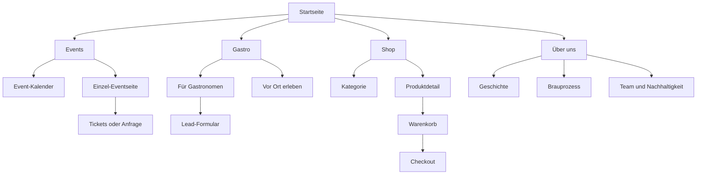

# Finaler Research-Bericht und Implementierungs-Prompt für eine Apple-inspirierte Premium-Website einer Münchner Brauerei

## Executive Summary

Für eine moderne Premium-Website einer Münchner Brauerei ist **nicht** die möglichst laute Effektdichte der richtige Weg, sondern eine **Apple-inspirierte Verbindung aus inhaltlichem Fokus, kontrollierter Bewegung, edler Materialität, klarer Typografie und messbarer Performance**. Apple beschreibt sein aktuelles Design selbst als content-fokussiert, dynamisch, adaptiv für Hell/Dunkel und getragen von „Liquid Glass“; Figma, Webflow, Motion und Three.js spiegeln parallel dazu den Trend zu 3D-Elementen, Scroll-Storytelling, ausdrucksstarker Typografie, Dark Mode, AI-gestützten Erlebnissen und nachhaltigem, zugänglichem Design. citeturn31view1turn34search1turn22view0turn11view1turn23view1turn11view6

Für dieses Projekt ist deshalb ein **„calm premium“ Ansatz** am sinnvollsten: Glassmorphism 2.0 nur dort, wo Hierarchie und Fokus gewinnen; Liquid-UI-Effekte nur als Akzent; Kinetic Typography nur in Hero- und Kapitel-Übergängen; 3D/WebGL sparsam für Hero-Inszenierung oder Produktobjekte; Scrollytelling vor allem auf der **Events-Seite** und in ausgewählten Story-Kapiteln auf Startseite und Über uns. Gleichzeitig müssen **Core Web Vitals**, mobile-first Umsetzung, `prefers-reduced-motion`, WCAG-Kontrast, Tastaturbedienbarkeit und DSGVO/BFSG-Konformität als harte Qualitätskriterien mitgedacht werden. Google empfiehlt mobile-first Konsistenz, hilfreiche Inhalte, saubere Meta Descriptions und strukturierte Daten; web.dev definiert LCP ≤ 2,5 s, INP ≤ 200 ms und CLS ≤ 0,1 am 75. Perzentil als Zielgrößen. citeturn13view2turn16view0turn16view1turn11view8turn13view6turn30search3turn30search16

Die **wichtigste strategische Entscheidung** ist die Plattformarchitektur. Für diese Aufgabenstellung ist **Webflow als Marketing- und Storytelling-Frontend mit CMS** am besten geeignet, weil Webflow inzwischen GSAP-basierte Interactions nativ in seine visuelle Arbeitsweise integriert, CMS-Inhalte und Localization gut unterstützt und für markenstarke, sequenzielle Seiten sehr schnell produktiv macht. Für den Shop gilt: **Webflow Ecommerce** ist für kleine, deutschsprachige Sortimente brauchbar; sobald Varianten, internationale Märkte oder skalierbare Commerce-Prozesse wichtiger werden, ist **Shopify** als Commerce-Backend die robustere Wahl. Framer ist stark für schnelle, motionreiche Landingpages, braucht für Commerce aber stärker Plugin-/Shopify-Anbindung. citeturn11view3turn16view4turn25search0turn25search1turn25search12turn26search3turn26search1turn13view10

Inhaltlich sollte die Website fünf Aufgaben gleichzeitig lösen: **Marke emotional aufladen**, **Events verkaufen oder anfragen**, **Gastro-/B2B-Leads erzeugen**, **Shop-Umsätze steigern** und **Vertrauen über Herkunft, Braukunst und Münchner Identität aufbauen**. Dafür empfiehlt sich eine Seitenstruktur, in der die Startseite als Kuratierungs- und Markenbühne funktioniert, die Events-Seite als narrative Erlebnisstrecke mit klaren Einzel-Eventseiten aufgebaut ist, die Gastro-Seite zwei Pfade für HoReCa und Vor-Ort-Genuss abbildet, der Shop editoriell statt kataloghaft wirkt und Über uns die Achse „Tradition × Innovation × Nachhaltigkeit × Handwerk“ erzählt. Münchens Bierkultur ist tatsächlich stark durch jahreszeitliche, traditionelle und erlebnisorientierte Formate geprägt; offizielle München- und Brauerei-Quellen zeigen, dass Brauerei-Führungen, saisonale Feste, Tradition, Gastlichkeit und Nachhaltigkeit glaubwürdige narrative Bausteine sind. citeturn36view0turn36view1turn24search16

Wichtig ist außerdem: **Marken-Assets sind nicht spezifiziert**, **Content-Mengen sind nicht spezifiziert** und die genaue Ausprägung von **„Gastro“** ist nicht spezifiziert. Deshalb sollte das Konzept modular sein und sowohl mit wenigen hochwertigen Inhalten als auch mit einem wachsenden CMS funktionieren. Rechtlich sollten DSGVO-/Cookie-Mechanik und BFSG-Relevanz insbesondere für **Shop**, **Ticketing**, **Formulare**, **Zahlung**, **Authentifizierung** und ggf. **Online-Buchung** vor dem Launch juristisch geprüft werden; die folgenden Empfehlungen sind belastbare Recherche- und Umsetzungsgrundlage, aber keine Rechtsberatung. citeturn12view1turn37view4turn37view3

## Trend- und Stilentscheidungen

Die belastbarsten Trendquellen für 2025–2026 zeigen eine klare Richtung: **immersive 3D-Elemente, experimentelle Navigation, starke Typografie, Dark Mode, Motion Design, AI-gestützte Nutzerführung sowie nachhaltiges und zugängliches Design**. Apple ergänzt dieses Bild mit seinem „Liquid Glass“-Paradigma: Transluzenz, Kontextadaptivität, Echtzeit-Rendering, Reduktion auf inhaltlichen Fokus und eine Navigation, die beim Scrollen kleiner wird, statt um Aufmerksamkeit zu konkurrieren. Für eine Münchner Brauerei ist das ideal, weil sich Handwerk, Materialität, Glas, Licht, Schaum, Metall, Flüssigkeit und saisonale Stimmung sehr gut in eine sensorische, aber kontrollierte Premiumsprache übersetzen lassen. citeturn22view0turn31view1turn34search5turn31view0

Die Trendanwendung sollte jedoch **kuratiert** und nicht additiv sein. Webflow warnt ausdrücklich davor, Parallax und Scroll-Effekte zu überreizen; W3C empfiehlt, Bewegung bei reduziertem Bewegungswunsch abschaltbar zu machen; WCAG fordert ausreichenden Kontrast und vollständige Tastaturbedienbarkeit. Das heißt praktisch: keine dauerhaften Vollseiten-Parallax-Exzesse, kein Scroll-Hijacking, keine unlesbaren Glasflächen, keine animierten Elemente als einzige Informationsquelle. Die moderne Wirkung entsteht hier durch **Rhythmus, Tiefenstaffelung, Mikro-Feedback und Bildregie**, nicht durch permanente Reizüberflutung. citeturn35view0turn13view6turn30search3turn30search16

### Trendvergleich mit Priorität und Umsetzungsaufwand

| Trend | Empfohlene Priorität | Umsetzungsaufwand | Konkrete Anwendung für die Brauerei | Primärquelle |
|---|---|---:|---|---|
| Glassmorphism 2.0 und Liquid UI | Sehr hoch | Mittel | Glasartige Navigation, Cards, Overlays und Filterflächen mit klarer Lesbarkeit; nur als Layer über Content, nicht als Dauereffekt | Apple Liquid Glass / Materials citeturn31view1turn34search1turn34search5 |
| Kinetic Typography | Hoch | Mittel | Hero-Headlines, Kapitelwechsel, Eventtitel, kurze Wortanimationen beim Scrollen | Figma Typografie-Trend / Apple Typography citeturn22view0turn21search7 |
| 3D WebGL und Three.js | Mittel bis hoch | Hoch | Hero-Objekt wie Bierflasche, Glas, Hopfen oder Fass; interaktive Produkt- oder Ingredient-Visuals | Figma Trend 3D / Three.js GLTFLoader citeturn22view0turn11view6 |
| Scrollytelling | Sehr hoch | Mittel bis hoch | Vor allem auf Events und Über uns: Kapitel, Sticky Panels, Fortschrittsanzeige, storybasierte Sequenzen | Figma Motion / Webflow Storytelling / GSAP ScrollTrigger citeturn22view0turn11view7turn23view0 |
| Scroll-Motion | Sehr hoch | Mittel | Reveal, Scrub, Pin, Progress, horizontale Momente in kuratierten Abschnitten | Motion Scroll Docs / GSAP / Framer Scroll Transforms citeturn23view1turn23view0turn11view4 |
| Micro-Interactions | Sehr hoch | Niedrig bis mittel | Hover, Press, Filterwechsel, Warenkorb, CTA-Feedback, Scroll-Indikatoren, Progress State | Webflow Interactions / Motion Docs citeturn16view4turn23view2 |
| Performance-first | Zwingend | Mittel | Lazy Loading, Code Splitting, moderne Bilder, video poster strategy, RUM + LHCI | web.dev / MDN / web-vitals citeturn11view8turn16view6turn17view0turn18view0turn28search0 |
| Accessibility-first | Zwingend | Mittel | `prefers-reduced-motion`, Kontrast, Keyboard, Fokus, steuerbare Carousels | W3C / WCAG / APG citeturn13view6turn30search3turn30search5turn30search16 |
| AI-Personalisierung | Mittel | Mittel bis hoch | Segmentierte Startseitenmodule, progressive Formulare, Produktempfehlungen, Event-Hinweise; nur consent-basiert | Figma AI Trends / Webflow Personalization Measurement / Apple Privacy Thinking citeturn20view0turn20view3turn20view2 |
| Dark Mode | Hoch | Mittel | System- oder Toggle-basiert; Gold/Kupfer-Akzente auf dunklem Graphit für Premiumlook | Apple Dark Mode / Figma Trend 5 citeturn8search4turn22view0 |
| Editorial Layouts | Hoch | Mittel | Großzügige Typografie, asymmetrische Bild-Text-Kompositionen, Magazinrhythmus statt Rastermonotonie | Webflow Editorial / Typography Guidance citeturn21search1turn21search5turn21search7 |

Die Konsequenz daraus ist eine klare Stilformel: **Apple-inspirierte Ruhe + Münchner Brauerei-Authentizität + editorielle Dramaturgie + performante, barrierebewusste Bewegung**. Die Website soll sich wie ein hochwertiges Markenobjekt anfühlen, aber zugleich Google-, Accessibility- und Performance-Kriterien erfüllen. citeturn31view1turn36view1turn11view8turn13view2turn16view0

## Informationsarchitektur und Seitenkonzept

Die Informationsarchitektur sollte so geplant werden, dass die Besucher je nach Intent schnell in einen passenden Pfad gezogen werden: **Marke entdecken**, **Events erleben**, **Gastro-Partner werden**, **Produkte kaufen**, **Herkunft verstehen**. Der entscheidende UX-Hebel ist dabei die Trennung zwischen **kuratierter Story-Ebene** und **funktionaler Navigations-Ebene**. Die Story-Ebene emotionalisiert; die funktionale Ebene hält jederzeit Orientierung, CTA-Zugang und Performance sauber. Apples Fokus-Philosophie, Google mobile-first und Webflows Storytelling-/Interactions-Ansatz sprechen genau für diese Zweiteilung. citeturn31view1turn13view2turn11view7turn16view4



### Seiten-Feature-Matrix

| Feature | Startseite | Events | Gastro | Shop | Über uns | Priorität |
|---|---|---|---|---|---|---|
| Cinematic Hero mit ruhiger Motion | ● | ● | ○ | ○ | ○ | Sehr hoch |
| Sticky Story Section | ● | ● | ○ | ○ | ● | Sehr hoch |
| Editorial Bild-Text-Kompositionen | ● | ● | ● | ● | ● | Hoch |
| Event-Kalender mit Filtern | — | ● | — | — | — | Zwingend |
| Einzelseiten mit Schema-Markup | ○ | ● | ○ | ● | ○ | Zwingend |
| B2B-Leadformular | ○ | ○ | ● | ○ | ○ | Hoch |
| Produktgrid und Produktdetail | ○ | — | ○ | ● | — | Zwingend |
| Timeline | ○ | ● | — | — | ● | Hoch |
| Scroll-Progress-Indikator | ● | ● | — | — | ● | Mittel |
| Dark Mode oder Auto-Theme | ● | ● | ● | ● | ● | Hoch |
| Mehrsprachigkeitsoption | ○ | ○ | ○ | ○ | ○ | Nicht spezifiziert |
| AI-Personalisierte Teaser | ○ | ○ | ○ | ○ | ○ | Optional |

Die Priorisierung in der Matrix folgt der Kombination aus Brand Storytelling, Conversion, Mobile-first SEO, strukturierten Daten, BFSG-/Accessibility-Relevanz und Performance-Disziplin. citeturn13view2turn13view3turn13view4turn37view4turn11view8

**Startseite.** Die Startseite muss in unter zehn Sekunden drei Dinge leisten: Markenwert spürbar machen, Münchner Herkunft plausibel verankern und den schnellsten Einstieg in Events, Gastro und Shop geben. Empfohlene Blöcke: ruhiger Hero mit Video oder cinematischem Bild, kurzer Markenclaim, „Warum diese Brauerei“-Bento/Editorial-Sektion, Event-Teaser, Gastro-Teaser, Shop-Bestseller, Brauerei-Erlebnis/Vorschau, Social Proof oder Presse-/Auszeichnungen, Footer mit Subnavigation. Primäre CTAs: **„Events entdecken“**, **„Für Gastro anfragen“**, **„Zum Shop“**. Motion: sanftes Hero-Reveal, Scroll-Progress, kleine Parallax-Tiefenlagen, Card-Hover, CTA-Feedback. Mobile-first: Hero als Poster/Fallback, kürzere Headline, weniger simultane Bewegungen. SEO: saubere H1, klare Value Proposition, `Organization`-Markup auf der Startseite. DSGVO: Consent erst vor nicht-essentiellen Embeds/Tracking. citeturn31view1turn36view1turn16view2turn12view1turn13view2

**Events.** Diese Seite ist der emotionale Mittelpunkt. Sie sollte Besucher **durch verschiedene Brauerei-Erlebnisse führen**, nicht nur Termine listen. Empfohlene Struktur: Hero mit aktuellem Saison-Motiv, darunter ein Sticky-Narrativ „Vom ersten Sud bis zur letzten Maß“, dann Abschnitte für Eventtypen wie **Brauereiführung**, **Tasting**, **Seasonal Release**, **Brauhaus-Abend**, **Live-Musik**, **Private Feiern/Corporate Events**. Danach folgt ein echter Kalender-/Listenmodus mit Filtern nach Datum, Format, Zielgruppe und Verfügbarkeit. Jedes Event braucht eine **eigene Detailseite mit eindeutiger URL**, semantisch sauberer Struktur und `Event`-Markup; Google empfiehlt für die Event Experience fokussierte Einzel-Eventseiten statt bloßer Sammelübersichten. Primäre CTAs: **„Platz sichern“**, **„Event anfragen“**, **„Kalender abonnieren“**. Animationen: Timeline, Scroll-Scrub, Progress-Leiste, horizontale Bildstrecke in einem Kapitel, Kinetic Headline beim Kapitelwechsel. Accessibility: keine Pflichtanimation ohne Alternative, Kalender/Filter keyboard- und screenreader-tauglich, „Liste statt Story“ Umschalter auf Mobile ideal. Die Münchner Bierkultur zeigt offiziell, wie stark Jahreszeiten, Tradition, Musik, Brauertage und Brauereierlebnis als glaubwürdige Storyachsen funktionieren. citeturn13view3turn29search6turn23view0turn23view1turn36view0turn36view1

**Gastro.** Die genaue Bedeutung von „Gastro“ ist **nicht spezifiziert**. Deshalb sollte die Seite zwei Pfade anbieten: **„Für Gastronomen“** und **„Vor Ort genießen“**. Für Gastronomen: Sortimentsübersicht, Fass-/Flaschenoptionen, Logistik/Belieferung, Beratung, Schankanlagen-/POS-Material, Ansprechpartner, Leadformular. Für Vor-Ort-Genuss: Restaurant/Brauhaus-Ambiente, Speise-/Bierpairing, Reservierungs- oder Kontakt-CTA, Karten-/Anfahrtsinfos. Primäre CTAs: **„Partnerschaft anfragen“**, **„Sortiment anfragen“**, **„Tisch/Erlebnis anfragen“**. Visuell eignet sich hier weniger wilde Scroll-Dramatik, dafür hochwertiges Editorial Layout mit Materialnähe, Bier-/Food-Pairing-Fotografie und Micro-Interactions bei Sortiment, Benefits und Formularelementen. SEO: klare Suchintentionen wie Brauerei Gastro, Bier für Gastronomie, Brauhaus München bedienen; People-first Content und vertrauenswürdige Kontaktinformationen sind vorteilhaft. citeturn16view0turn36view1turn24search16

**Shop.** Der Shop darf nicht wie ein generischer Kachelkatalog wirken. Empfohlen ist ein **editoriell kuratierter Commerce-Auftritt** mit Bestseller-Block, saisonalem Drop, Geschenkideen, Bundles und danach dem Produktgrid. Produktdetailseiten sollten aus Galerie, Kurzstory, Geschmacksprofil, Stil/Pairing, Variantenauswahl, Verfügbarkeit, Lieferinfo, Trust-Bausteinen und sticky Kaufmodul bestehen. Für Google sind `Product`-Markup, sichtbare Preis-/Verfügbarkeitsdaten, Bilder, Variantenlogik und saubere Merchant-/Product-Informationen relevant; wenn Produkte gekauft werden können, spricht Google von Merchant Listings. Für Varianten können `ProductGroup`/Varianten-Logik sinnvoll sein. Accessibility und BFSG sind hier besonders wichtig, weil Online-Shops und ihre Identifizierungs-, Authentifizierungs-, Sicherheits- und Zahlungsfunktionen im deutschen Rechtsrahmen explizit relevant sein können, sofern das Angebot in den BFSG-Anwendungsbereich fällt. Primäre CTAs: **„In den Warenkorb“**, **„Jetzt kaufen“**, **„Als Geschenk entdecken“**. Mobile-first: Sticky Buy Bar, große Touch-Ziele, vereinfachte Galerie, kein schweres 3D auf PDPs ohne Fallback. citeturn13view4turn29search1turn29search9turn37view4turn12view1

**Über uns.** Diese Seite sollte nicht nur Historie ablegen, sondern Vertrauen, Unterschied und Haltung erzählen. Empfohlene Blöcke: Ursprung in München, Gründungsmoment, Brauprozess, Rohstoffe, Menschen hinter der Brauerei, Nachhaltigkeit, Standort, Presse/Partner, evtl. Karriere/Newsletter. Offizielle Brauerei-Beispiele zeigen, dass **Tradition, Brauereiführung, Sortimentsvielfalt, Umweltstrategie und News** glaubwürdige Content-Säulen sind. Motion: horizontale oder vertikale Timeline, kleine Ingredient-Reveals, interaktive Prozessgrafik, dezentes Zahlen-/Fakten-Counting. CTA: **„Brauerei erleben“**, **„Unsere Biere entdecken“**, **„Kontakt aufnehmen“**. SEO: ausformulierte, originäre Story und gute About-Page-Signale stärken Vertrauen; Google nennt explizit Hintergrund zum publizierenden Unternehmen als Vertrauenssignal. citeturn36view1turn16view0

### Beispiel-Wireframe-Skizzen

**Startseite Desktop**

```text
┌───────────────────────────────────────────────────────────────┐
│ Glass Nav: Logo | Start | Events | Gastro | Shop | Über uns  │
├───────────────────────────────────────────────────────────────┤
│ Full-Bleed Hero Video / Image                                │
│ Headline + Subline + CTA Events / Shop / Gastro             │
│ Scroll cue + subtle progress                                 │
├───────────────────────────────────────────────────────────────┤
│ Editorial USP Block      │ Seasonal Event Teaser             │
│ Herkunft / Handwerk      │ nächstes Highlight + CTA          │
├───────────────────────────────────────────────────────────────┤
│ Sticky Story Section: Bier. Stadt. Erlebnis.                 │
│ left = text chapters | right = image/video                   │
├───────────────────────────────────────────────────────────────┤
│ Shop Highlights │ Gastro Highlights │ Über uns Preview       │
├───────────────────────────────────────────────────────────────┤
│ Footer: Kontakt / Newsletter / Social / Rechtliches          │
└───────────────────────────────────────────────────────────────┘
```

**Events Mobile**

```text
┌───────────────────────┐
│ Logo      Menu        │
├───────────────────────┤
│ Hero Image            │
│ „Events in der        │
│ Brauerei erleben“     │
│ CTA: Plätze sichern   │
├───────────────────────┤
│ Filter Chips          │
│ [Heute] [Tasting] ... │
├───────────────────────┤
│ Sticky progress bar   │
├───────────────────────┤
│ Story Card 1          │
│ Bild                  │
│ Titel + Kurztext      │
│ CTA                   │
├───────────────────────┤
│ Story Card 2          │
├───────────────────────┤
│ Kalenderliste         │
│ Datum / Uhrzeit / CTA │
└───────────────────────┘
```

## Technik- und Betriebsmodell

Die technische Umsetzung sollte nach dem Prinzip **„Motion nur, wenn messbar sauber“** gebaut werden. GSAP ScrollTrigger ist für präzise Scroll-Sequenzen, Pinning und Scrubbing sehr stark; Motion/Framer Motion ist hervorragend für React-/Framer-nahe Scroll- und In-View-Animationen und kann mit `LazyMotion` den Initial-Bundle deutlich reduzieren; Three.js ist der Standard für WebGL/3D und lädt glTF 2.0 nativ; Lottie ist sinnvoll für kleine UI-Animationen und Illustrations-Motion, aber nicht für alles, was eigentlich durch CSS/transform günstiger wäre. citeturn23view0turn23view1turn16view5turn11view6turn13view7

### Tech-Stack-Empfehlung mit Vor- und Nachteilen

| Stack | Vorteile | Nachteile | Empfohlener Fit | Quelle |
|---|---|---|---|---|
| **Webflow + CMS + GSAP Interactions** | Sehr stark für visuelles Storytelling, CMS, Lokalisierung, schnelle Iteration; GSAP ist inzwischen nativ in Interactions verankert | Webflow Ecommerce ist funktional, aber Localization unterstützt Ecommerce-Produkte/-Seiten nicht; komplexer Commerce skaliert begrenzt | **Beste Gesamtwahl** für Startseite, Events, Gastro, Über uns; Shop klein bis mittel | Webflow Interactions / CMS / Localization / Ecommerce citeturn11view3turn16view4turn25search0turn25search1turn25search12 |
| **Webflow Frontend + Shopify Backend** | Best of both worlds: Storytelling im Frontend, robuster Commerce im Backend | Mehr Integrationsaufwand, Care für Datenflüsse nötig | **Empfehlung**, wenn Shop wichtig wächst oder Varianten/Internationalisierung relevant werden | Shopify Hydrogen / Webflow docs citeturn13view10turn25search1turn25search12 |
| **Framer + CMS + Framer Commerce Plugin / Shopify Sync** | Sehr schnelle motionreiche Umsetzung, eingebaute SEO-/Performance-Versprechen, gute Localization, Shopify-Sync via Plugin | Commerce stärker pluginabhängig, komplexe redaktionelle Datenmodelle oft weniger flexibel als WP | Gut für visuell starke Premium-Landingpages und kleinere bis mittlere Commerce-Setups | Framer CMS / Localization / Commerce / Site features citeturn13view9turn26search2turn26search1turn26search3 |
| **WordPress + WooCommerce + GSAP** | Maximale Erweiterbarkeit, starkes Content-Ökosystem, WooCommerce kann strukturierte Daten und Performance-Optimierungen gut abbilden | Höherer Pflege- und Governance-Aufwand, Premium-Motion braucht saubere Frontend-Disziplin | Gut, wenn redaktionelle Tiefe, Integrationen und langfristige Eigenkontrolle wichtiger sind als Builder-Speed | WooCommerce Storefront / HPOS / structured data code refs citeturn27search1turn27search10turn27search9 |
| **Shopify Headless mit Hydrogen** | Sehr stark für Commerce, skalierbar, modern, international | Für contentreiche Brauerei-Story-Seiten meist der aufwendigste Weg | Nur empfehlenswert, wenn Shop strategisch die Hauptfunktion wird | Shopify Hydrogen docs citeturn13view10 |

**Klare Empfehlung:** Für diese Brauerei-Website ist **Webflow-first** die beste Hauptentscheidung. Wenn der Shop nur kuratiert und überschaubar ist, kann Webflow Ecommerce genügen; wenn Produktvarianten, Märkte, Fulfillment und Shop-Wachstum zentral werden, sollte frühzeitig **Shopify als Commerce-Backend** eingeplant werden. Das ist die aus den aktuellen offiziellen Plattformfähigkeiten am besten begründbare Kombination. citeturn25search0turn25search12turn13view10

### Performance, Optimierung, SEO, strukturierte Daten und Compliance

| Bereich | Empfohlene Umsetzung | Zielgröße / Methode | Quelle |
|---|---|---|---|
| Core Web Vitals | LCP, INP, CLS bereits in Design und Build als Freigabekriterien führen | LCP ≤ 2,5 s, INP ≤ 200 ms, CLS ≤ 0,1 am P75 | web.dev Web Vitals citeturn11view8 |
| RUM | `web-vitals` im Livebetrieb erfassen; segmentiert nach Mobil/Desktop | Reale Nutzerdaten statt nur Lab-Daten | web-vitals / web.dev / CrUX citeturn28search0turn11view8turn28search3 |
| CI-Monitoring | Lighthouse CI auf kritischen Templates/URLs | Regressionen pro Commit erkennen | LHCI / Lighthouse docs citeturn28search1turn28search9turn28search21 |
| Bilder | AVIF/WebP via `<picture>`, feste Größen, responsive `srcset`, Kompression | Schnellere Downloads, besseres LCP | web.dev Image Performance / WebP docs citeturn18view0turn18view1 |
| Videos | Hero nur mit klarer Strategie: `poster`, ggf. preload des Posters; Offscreen mit `preload="none"`/`metadata` und `loading="lazy"` | Video darf LCP nicht ruinieren | web.dev Video Performance citeturn17view3turn17view4 |
| Lazy Loading | Nur nicht-kritische Assets lazy laden | Kritischer Renderpfad kürzer | MDN Lazy Loading citeturn16view6 |
| Code Splitting | Motion/3D/Formulare/Buchungslogik on demand laden | Weniger JS beim Start, besseres INP | web.dev Code Split / Motion LazyMotion citeturn17view0turn16view5 |
| SEO Seitentitel/Inhalte | Klare Titles, Meta Descriptions, hilfreiche Inhalte, originäre Texte | People-first, starke Snippets | Google Search Central citeturn16view0turn16view1 |
| Mobile-first SEO | Mobile und Desktop inhaltlich konsistent | Smartphone-Version ist maßgeblich | Google Mobile-first indexing citeturn13view2 |
| Structured Data Events | Einzel-Eventseiten mit `Event` JSON-LD und eigener URL | Eligibility für Event Experience | Google Event docs / Schema.org Event citeturn13view3turn29search6turn29search0 |
| Structured Data Shop | `Product`, ggf. `ProductGroup`, `Offer`, `BreadcrumbList`, `Organization` | Rich Results und bessere Produktdarstellung | Google Product / Organization / Breadcrumb citeturn13view4turn16view2turn16view3turn29search9 |
| DSGVO/Cookies | Nur notwendige Cookies ohne Consent; Analytics/Marketing nur mit Einwilligung; klare Datenschutzerklärung | Technisch notwendige vs. nicht notwendige Cookies trennen | BfDI Cookies citeturn12view1 |
| BFSG | Shop, Buchung, Login, Zahlung und interaktive Verbraucher-Dienste barrierefrei planen; Kleinstunternehmen-Ausnahme prüfen | Gilt seit 28.06.2025; Online-Shops und Buchungs-/Vertragsservices relevant | Bundesfachstelle / BMAS citeturn37view4turn37view3turn11view9 |

Zusätzlich empfehle ich eine **CMS-Struktur mit Collections** für Events, Produkte, Story-Kapitel, News/Journal, Team und ggf. Gastro-Anwendungsfälle. Gerade bei Events ist das wichtig, weil Google für ein gutes Event-Markup **eigene URLs pro Event** erwartet und Figma/Webflow/Framer gleichermaßen zeigen, dass moderne Erlebniswebsites am besten funktionieren, wenn Inszenierung und strukturierte Daten aus einem sauberen Inhaltsmodell erzeugt werden. citeturn13view3turn29search6turn25search3turn13view9

## Designsystem und Komponenten

Da **keine Marken-Assets vorgegeben** sind, sollten die Design-Tokens als **strategischer Vorschlag** verstanden werden. Sie leiten sich aus Apple-inspirierter Materialität, adaptiven Hell-/Dunkel-Prinzipien, editorialer Typografie, Münchner Brauereikultur und Accessibility-Anforderungen ab. Apple betont adaptive Farben, Dark Mode, Materiallayers und lesbare Hierarchie; WCAG verlangt ausreichenden Kontrast. citeturn21search19turn8search4turn34search5turn21search7turn30search3

### Empfohlene Design-Tokens

| Token-Gruppe | Empfehlung |
|---|---|
| **Primärfarben** | Graphit `#0B0D10`, Off-White `#F5F4EF`, Helles Gold `#D6B36A`, Kupfer `#A56A3F`, Hopfen-Grün `#66754A`, Stein `#C9C5BC` |
| **Dark-Mode-Akzente** | Tiefes Anthrazit `#121418`, Frost-Weiß `rgba(255,255,255,0.16)`, Gold-Glow `rgba(214,179,106,0.22)` |
| **Glass-Flächen** | Light: `rgba(255,255,255,0.12)` + Backdrop Blur 18–24 px; Dark: `rgba(18,20,24,0.48)` + Blur 18–24 px |
| **Typografie** | Display: markante, aber ruhige Grotesk; Text: hochlesbare Sans. Praktisch: `Inter`, `Instrument Sans`, `Manrope` oder lizenzierte Premium-Grotesk. |
| **Typo-Skala** | Hero 72–104 px Desktop / 40–56 px Mobile; H2 40–56 px; H3 28–36 px; Body 18–20 px Desktop / 16–18 px Mobile; Minor 14 px |
| **Spacing** | 8-pt-orientiert: 4 / 8 / 12 / 16 / 24 / 32 / 48 / 64 / 96 / 144 |
| **Grid** | Desktop 12 Spalten, 80–96 px Außenabstand; Tablet 8 Spalten; Mobile 4 Spalten, 16–20 px Außenabstand |
| **Radius** | 20–28 px für Cards, 999 px für Pills/Chips, 32–40 px für Hero-Buttons |
| **Schatten/Depth** | Weiche, breite Schatten; nur eine dominante Depth-Ebene pro Abschnitt |
| **Motion-Dauer** | Micro 120–180 ms, Standard 240–420 ms, Story-Übergang 500–900 ms |
| **Easing** | weich, organisch, niemals „bouncy“ verspielt; Premium statt gamifiziert |

### Beispiel-Komponenten

**Hero.** Full-bleed Visual, große Kinetic Headline, kurze Subline, 2 Primär-CTAs, ruhiger Scroll-Indikator. Optional ein 3D-Motiv oder cinematisches Bier-/Braumotiv. Desktop mit Split- oder Center-Hero; Mobile mit statischem Posterbild und stark vereinfachter Motion. 

**Product Card.** Großes, freigestelltes Produktbild, Name, Stil/Typ, kurzer Sensorik-Hinweis, Preis und eindeutige CTA. Hover nur leicht: Scale `1.02`, Shadow/Glow, Mikro-Verschiebung des Etiketts oder der Glasreflexion. Keine flackernden 3D-Tilts auf Mobile.

**Event Card.** Datum prominent, Eventtyp als Pill, Titel, 2-zeilige Teaser-Copy, Status/Verfügbarkeit, CTA. Optional ein Story-Variant-Stil mit großem Bild und Kapitelnummer.

**Timeline.** Vertikal sticky für Events/Über uns. Linke Spalte Progress + Kapitel, rechte Spalte Visual/Copy. Mobile als Akkordeon-Liste oder stepperartige Kartenfolge.

**Sticky Story.** Kapitelweise pinned Section mit Bild-/Video-Wechsel und synchroner Textentwicklung. Gut für „Wie ein Abend in der Brauerei abläuft“ oder „Vom Hopfen zur Flasche“.

**Horizontal Scroll.** Nur in einem kuratierten Abschnitt einsetzen, z. B. „Jahreszeiten der Brauerei“ oder „Sortimentswelt“. Auf Mobile durch Swipe-Carousels oder vertikale Stacks ersetzen.

### Referenzseiten und Inspirationsquellen

Die folgenden offiziellen bzw. primärnahen Beispiele sind als **klickbare Referenzlinks über die Zitate** nutzbar:

| Referenz | Warum relevant |
|---|---|
| Apple Design / Liquid Glass citeturn31view0turn31view1 | Maßstab für contentorientierte Materialität, adaptive Transluzenz und Motion-Disziplin |
| Apple iPhone / Apple Watch Produktseiten citeturn7search3turn7search2 | Gute Referenz für lange, thematisch gegliederte Produkt- und Storyseiten |
| Webflow Storytelling / Interactive Storytelling citeturn24search3turn24search11 | Gute Inspirationsquellen für narrative Website-Strukturen |
| Webflow Scroll / Parallax Beispiele citeturn35view0turn4search7 | Nützlich für kontrollierte Scroll-Effekte und ihre Grenzen |
| Motion Scroll Examples citeturn23view1turn23view2 | Technische Referenz für performant umsetzbare Scroll-Motion |
| Three.js Beispiele / GLTFLoader citeturn11view6turn5search13 | Referenz für gezielte 3D-Inszenierungen |
| Hofbräu München citeturn36view1 | Inhaltliche Referenz für Brauerei-Tour, Tradition, Sortiment und Nachhaltigkeit |
| Munich Beer Calendar citeturn36view0 | Authentische Münchner Event- und Jahreszeitenlogik für die Events-Seite |

## Vollständiger, implementierungsreifer Prompt

Der folgende Prompt ist als **Copy-Paste-Briefing für Designer, Entwickler oder AI-Builder wie Webflow, Framer oder Lovely** formuliert und fasst die oben priorisierten Anforderungen in eine umsetzungsnahe Form zusammen. Er basiert auf den dokumentierten Design-, Motion-, Performance-, SEO-, Accessibility- und Compliance-Anforderungen aus Apple-, Figma-, Webflow-, Motion-, Three.js-, Google-, W3C- und deutschen Behördenquellen. citeturn31view1turn22view0turn11view3turn23view1turn11view6turn11view8turn12view1turn37view4

**Prompttext**

Erstelle eine moderne, hochwertige, Apple-inspirierte Premium-Website für eine Münchner Brauerei. Die Seite soll nicht wie eine generische Biermarke wirken, sondern wie ein präzise gestaltetes digitales Markenerlebnis: ruhig, elegant, emotional, sensorisch, modern und technisch hochwertig. Die visuelle Richtung soll sich an aktuellen Premium-Webdesign-Trends 2024–2026 orientieren: Glassmorphism 2.0, Liquid UI / Liquid-Glass-Anmutung, Kinetic Typography, ausgewählte 3D-WebGL-Elemente, Scrollytelling, Scroll-Motion, Micro-Interactions, Dark Mode, Editorial Layouts, Accessibility-first und Performance-first. Verwende diese Trends jedoch kuratiert und zurückhaltend. Kein Effekt darf Selbstzweck sein. Der Fokus liegt immer auf Inhalt, Orientierung, Lesbarkeit, Markenwirkung und Conversion.

Die Marke ist eine urbane Münchner Brauerei mit Premiumanspruch. Die Website soll Münchner Identität, Braukunst, Gastlichkeit, Tradition und moderne Markenästhetik verbinden. Verwende keine direkte Apple-Kopie, sondern übersetze Apple-Prinzipien in ein eigenständiges Brauerei-Erlebnis: content-first, viel Weißraum bzw. kontrollierte dunkle Flächen, weiche Transparenzen, harmonische Layer, hochwertige Typografie, präzise Details, dynamische, aber ruhige Bewegung. Das Design soll sich luxuriös und modern anfühlen. Die Farbwelt soll auf Graphit, Off-White, Gold/Kupfer und gedecktem Hopfen-Grün basieren. Die Typografie soll editorial, klar, groß und selbstbewusst sein. Headlines dürfen sehr groß und emotional sein, Fließtexte müssen hervorragend lesbar sein.

Die Website hat die Seiten **Startseite**, **Events**, **Gastro**, **Shop** und **Über uns**. Alle Seiten müssen modern, grafisch hochwertig, responsive, mobile-first und conversion-orientiert aufgebaut sein. Jede Seite soll ein Erlebnis erzeugen, aber gleichzeitig klar navigierbar und performant bleiben.

Auf der **Startseite** soll ein cinematischer Hero-Bereich mit hochwertigem Bewegtbild oder starkem statischem Key Visual stehen. Der Hero enthält eine große emotionale Headline, eine subtile Kinetic-Typography-Anmutung, eine kurze Subline und drei zentrale CTAs: „Events entdecken“, „Für Gastro anfragen“ und „Zum Shop“. Direkt darunter soll eine kuratierte Story-Ebene folgen: Herkunft der Brauerei, Braukunst, saisonale Highlights, Event-Teaser, Gastro-Teaser, Shop-Bestseller und ein prägnanter Über-uns-Teaser. Nutze Sticky Story Sections, dezente Scroll-Progress-Indikatoren, sanfte Parallax-Tiefenlagen, hochwertige Hover-Effekte und glasartige Overlays, aber nur dort, wo Hierarchie und Fokus verbessert werden. Die Nav soll beim Scrollen kleiner und kompakter werden und wie eine edle, transluzente Systemleiste wirken.

Die **Events-Seite** ist die wichtigste Erlebnis-Seite und soll Besucher durch verschiedene Events in der Brauerei führen. Die Seite darf nicht nur Termine auflisten, sondern muss wie eine narrative Reise aufgebaut sein. Beginne mit einem starken Hero, dann führe durch Event-Kapitel wie Brauereiführung, Tasting, Seasonal Release, Brauhaus-Abend, Live-Musik, private Feiern oder Corporate Events. Verwende Sticky-Abschnitte, eine vertikale Timeline, Scroll-Scrubbing, Kapitelwechsel, großformatige Bild- oder Video-Übergänge, kontrollierte horizontale Momente und sehr starke Event-Cards. Danach soll ein funktionaler Kalender- bzw. Listenbereich mit Filtern nach Datum, Format und Zielgruppe folgen. Jede Event-Kachel muss Platz für Datum, Uhrzeit, Typ, Verfügbarkeit, Teasertext und CTA haben. Für einzelne Events müssen Detailseiten vorgesehen werden mit eigener URL, Hero, Ablauf, Leistungen, FAQ, CTA und Ticket-/Anfrage-Modul. Die Events-Seite soll emotional wirken, gleichzeitig aber immer Orientierung bieten. Kein Scroll-Hijacking. Storytelling und Funktion müssen parallel funktionieren.

Die **Gastro-Seite** soll hochwertig und vertrauensbildend wirken. Baue zwei mögliche Nutzerpfade ein: „Für Gastronomen“ und „Vor Ort genießen“, da die genaue Ausprägung von Gastro nicht spezifiziert ist. Zeige Sortiment, Qualitätsargumente, mögliche Belieferung oder Zusammenarbeit, Beratung, Schank-/POS-Unterstützung und Ansprechpartner. Wenn sinnvoll, ergänze einen Bereich für Brauhaus-/Vor-Ort-Erlebnis mit Speise-/Bierpairings, Atmosphäre und Anfrageoption. Die Seite soll editoriell, klar und weniger verspielt wirken als Events. Fokus auf Vertrauen, Qualität, Partnerschaft und Münchner Gastlichkeit. CTA-Ziele: „Partnerschaft anfragen“, „Sortiment anfragen“, „Erlebnis anfragen“.

Die **Shop-Seite** soll nicht wie ein Standard-Katalog aussehen, sondern wie ein editoriell kuratierter Premium-Shop. Nutze großzügige Produktkarten, Freisteller, hochwertige Makrodetails, Geschmacks- oder Stilhinweise und saisonale Drops. Die Shop-Startseite soll kuratierte Einstiege enthalten: Bestseller, saisonale Highlights, Geschenkideen, Bundles. Produktdetailseiten sollen eine starke Bildsprache, Produktstory, Geschmacksprofil, Braustil, Pairing-Hinweise, Varianten, Preis, Verfügbarkeit, Lieferdetails und eine klare sticky Buy Box enthalten. Der Checkout selbst kann technisch extern oder systemabhängig gelöst sein, aber die UX davor muss hochwertig, klar und barrierearm sein. Wenn ein 3D-Element eingesetzt wird, dann nur als optionales Highlight auf wenigen Produkten und mit Mobile-Fallback.

Die **Über-uns-Seite** soll Vertrauen und Differenzierung aufbauen. Erzähle Herkunft, Münchner Identität, Geschichte, Brauprozess, Rohstoffe, Team, Philosophie und Nachhaltigkeit. Verwende eine Mischung aus Timeline, editoriellen Bild-Text-Kompositionen, ruhigen Story-Übergängen und einer interaktiven, aber fokussierten Darstellung des Brauprozesses. Zeige die Balance aus Tradition und Innovation. Integriere am Ende einen klaren CTA zu Events, Shop oder Kontakt.

Global soll die Seite folgende Designprinzipien einhalten: großzügige Abstände, 12-Spalten-Grid auf Desktop, 8/4-Spalten auf Tablet/Mobile, weiche große Radien, hochwertige Schatten, nur eine dominante Tiefenebene pro Abschnitt, systematisch eingesetzte Glas-Layer, starke Editorial-Typografie, selektive Kinetic Typography, kontrollierte Micro-Interactions, ruhige Premium-Easings, keine überladene Gamification, keine billigen Glow-Effekte, keine billige Standard-Bieroptik. Der Gesamteindruck soll „präzise, luxuriös, modern, münchnerisch, sinnlich, glaubwürdig“ sein.

Setze Motion bewusst ein. Nutze Scroll-Reveals, In-View-Fades, Scrubbed Transforms, Sticky Panels, Progress Bars, sanfte Bild-Parallax, Button-Hover, Card-Hover und Kapitel-Übergänge. Vermeide permanente, aggressive oder vestibulär problematische Bewegungen. Implementiere eine `prefers-reduced-motion`-Strategie: bei reduziertem Bewegungswunsch müssen Story-Animationen vereinfacht oder deaktiviert sein. Alle zentralen Informationen müssen auch ohne Animation verständlich bleiben.

Denke mobile-first. Auf Mobile müssen Story-Elemente in einfachere, vertikale Sequenzen übersetzt werden. Keine schweren WebGL-Szenen ohne Fallback. Hero-Videos brauchen Poster-Strategie. Große Headlines müssen über `clamp()` oder vergleichbare fluid typography sauber skalieren. Touch-Ziele groß, Navigation einfach, Filter bedienbar, Produkt- und Event-CTAs sticky oder klar erreichbar.

Berücksichtige Accessibility konsequent: ausreichender Kontrast, Tastaturbedienbarkeit, sichtbare Fokuszustände, semantische HTML-Struktur, Screenreader-freundliche Labels, steuerbare Carousels/Slideshows, sinnvolle Alt-Texte, keine Information nur über Farbe oder Bewegung. Halte regulären Text mindestens WCAG-AA-tauglich. Glas- und Transparenzeffekte dürfen Lesbarkeit niemals verschlechtern.

Berücksichtige SEO und Struktur von Anfang an: klare H1/H2-Hierarchie, einzigartige Metadaten pro Seite, hilfreiche und originäre Texte, mobile-first Content-Parität, saubere interne Verlinkung, semantische URLs. Lege strukturierte Daten an: `Organization` für die Startseite, `Event` für jede Event-Detailseite, `Product` und ggf. Varianten-/Angebotslogik für Produktseiten, `BreadcrumbList` für tiefe Seiten. Falls Shop und Eventbuchung vorhanden sind, plane die benötigten Datenmodelle CMS-seitig sauber vor.

Berücksichtige DSGVO und deutsche Rahmenbedingungen von Anfang an. Nicht notwendige Tracking- oder Marketingtechnologien nur nach Einwilligung. Datenschutzerklärung, Impressum und saubere Consent-Logik einplanen. Wenn Shop, Buchung, Login, Zahlung oder andere interaktive Verbraucher-Dienste enthalten sind, Accessibility und BFSG-relevante Funktionen besonders sorgfältig gestalten. Technische Einbettungen wie Instagram, Maps oder Videoanbieter nur consent-basiert laden oder mit Privacy-Fallback vorbereiten.

Berücksichtige Performance-first in allen Designentscheidungen: moderne Bildformate wie AVIF/WebP, responsive Bilder über `srcset`, Videos nur gezielt und optimiert, Lazy Loading für nicht-kritische Medien, Code Splitting für Animation, 3D und schwere Module, minimale Third-Party-Last, systematische Performance-Messung. Ziel ist eine hochwertige Premium-Seite, die trotz Erlebnischarakter schnell lädt und flüssig bleibt.

Empfehle eine umsetzbare technische Struktur. Bevorzugt: Webflow als Hauptplattform für Marketing- und Storytelling-Seiten, CMS für Events/Storys/Team/News, optional Shopify oder ein anderes Commerce-Backend für einen größeren Shop. Alternativ Framer für motionstarke Prototypen oder Landingpages. Gib für alle Seiten modulare, wiederverwendbare Komponenten aus: Hero, Section Header, Glass Nav, Event Card, Product Card, Sticky Story, Timeline, Testimonial, CTA Band, Footer.

Erstelle das Ergebnis so, dass es direkt für Design, Visual Build und Entwicklung umsetzbar ist. Gib eine klare Seitenstruktur, Komponentenstruktur, Motion-Hierarchie, Responsive-Regeln und Content-Logik aus. Das Ergebnis soll wie ein modernes digitales Premiumprodukt wirken – nicht wie ein gewöhnlicher Brauerei-Auftritt.

## Offene Fragen und Grenzen

Nicht spezifiziert sind aktuell: **Markenlogo**, **verbindliche Hausschrift**, **Bildwelt/Foto-Assets**, **Produktanzahl**, **ob Ticketverkauf intern oder extern erfolgt**, **ob Shop nur Deutschland oder auch internationale Märkte bedient**, **ob „Gastro“ primär B2B oder Vor-Ort-Gastronomie bedeutet** und **ob Mehrsprachigkeit geplant ist**. Diese Punkte beeinflussen vor allem CMS-Modell, Commerce-Architektur, Content-Tiefe und Lokalisierungsstrategie. citeturn25search1turn25search12turn26search2turn13view10

Rechtlich gilt: Die DSGVO-/Cookie- und BFSG-Hinweise in diesem Bericht sind als **fundierte Umsetzungsorientierung** zu verstehen. Für einen Live-Launch mit Shop, Tickets, Login, Zahlung, Newsletter, CRM-Tracking oder weiteren personenbezogenen Daten sollte vor Go-live eine **juristische Prüfung** erfolgen. Gerade für Online-Shops und verbraucherbezogene interaktive Dienste benennt die Bundesfachstelle Barrierefreiheit relevante Anforderungen; zugleich bestehen Ausnahmen für bestimmte Kleinstunternehmen, deren konkrete Anwendbarkeit im Einzelfall zu prüfen ist. citeturn12view1turn37view4turn37view3